# SpaceTyping

An artistic visualization program that maps keyboard and mouse input to constellations in space. Works only on larger screen sizes (ie.
not mobile or tablet). The pressed key is mapped to a shape drawn on the corresponding position of the screen (ie. 1 is mapped to the 
top left corner of the screen, spacebar to the bottom of the screen, etc). Watch a quick gif of me interacting with it below:

## Slight Offset Applied When Key Pressed:
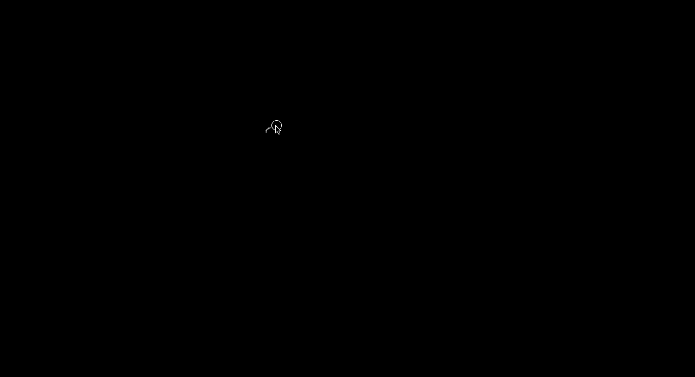

A slight offset is applied whenever a key is pressed so that you can see multiple key presses clearly. For example,
here, the user presses q three times, and three shapes are seen.

## Type of Key Pressed:
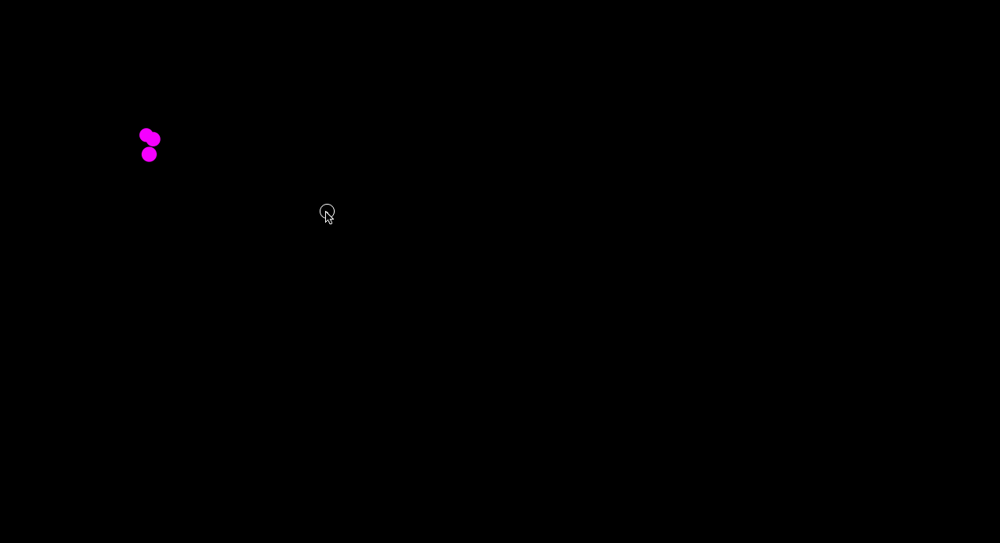

The type of key that was pressed (punctuation, space, numbers, etc) was mapped to the colour of the shape drawn on the screen (yellow 
for numbers, pink for consonants, blue for vowels, purple for punctuation, green for miscellaneous symbols such as =, +, ~, and white 
for “whitespace” characters such as tab, enter, or spacebar).

## Duration of Keystokes:
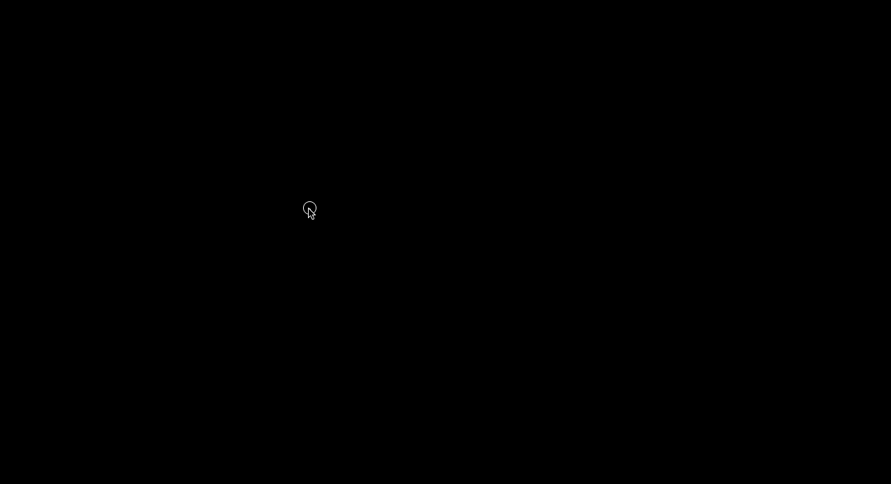
The duration of keystrokes was mapped to the size/radius of the shape drawn (the longer the keystroke, the larger the size of the shape). 
For example, if the user pressed 1 for five seconds, they would see a larger yellow shape in the top left corner of their screen than if 
they pressed 1 for 0.5 seconds.	

## Shift vs Nonshift Keystrokes:
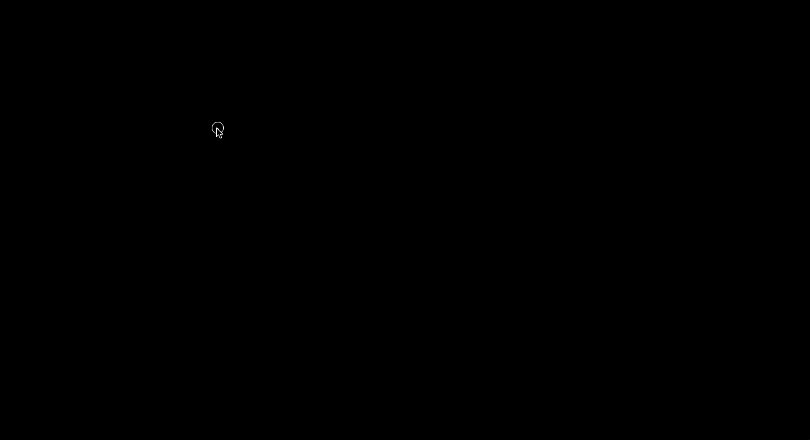
Whether shift was pressed or not was mapped to the shape itself (circle for non-shift presses, square for when shift is pressed). 
For example, if the user pressed Q using shift and without shift, they would see one pink circle and one pink square. 	

## Connecting the Letters in a Word:
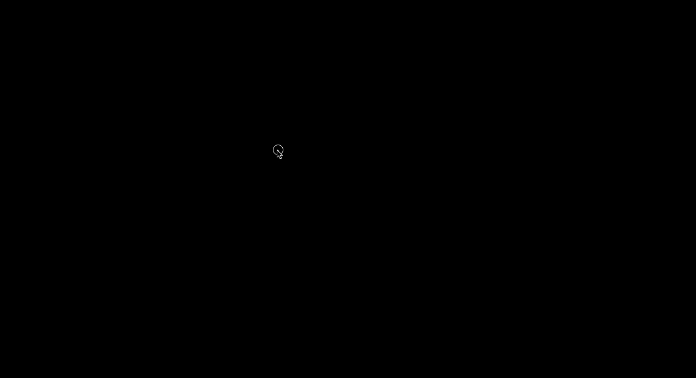
Every spacebar (or tab, or enter, any whitespace) press was mapped to a white shape on the screen (much like what was previously shown), 
along with every shape in the word being connected by a directional white line (like a “constellation” between all letters on screen). 
In other words, a whitespace character “completes” a word by connecting the shapes representing all the letters in the word. 
The constellation does not include the shape representing the whitespace character (ie. there is no line going to or from it). 
For example, if I type in “Prem” and press spacebar, there will be directional lines connecting the shapes representing P, r, e, m.

## Backspace/Deleting Keystrokes:
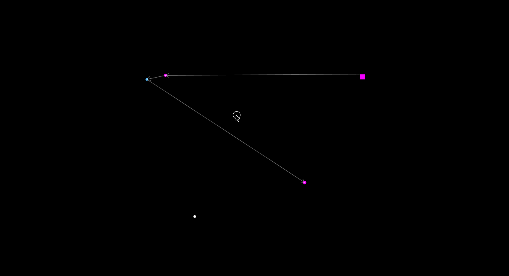
Whether backspace was used was mapped to a change in background colour (with the screen turning red whenever backspace is pressed) and a 
removal of the shape corresponding to the previous keypress. It also disconnects a constellation should the backspace remove the whitespace 
character immediately after a word. For example, if I type in “Prem “ but then remove the space after the m, the lines connecting P, r, e, m 
will disappear. In other words, if your backspace results in you editing or “uncompleting” a word, the constellation pertaining to that word no longer exists.

## Brightness of Constellation:
### Brightness when Typing Fast:
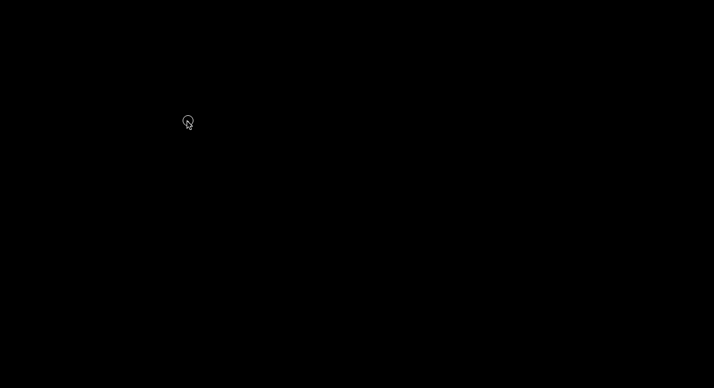

The speed at which a word was typed was mapped to the brightness (the value visual variable) of the lines connecting all the letters. 
In other words, the brightness of the constellation. A word is completed when a whitespace character is entered after it. For example, if I type “Prem” and then 
press space quickly, the constellation would be brighter than if I type “Prem” and press space slowly. 

### Brightness when Typing Slow:
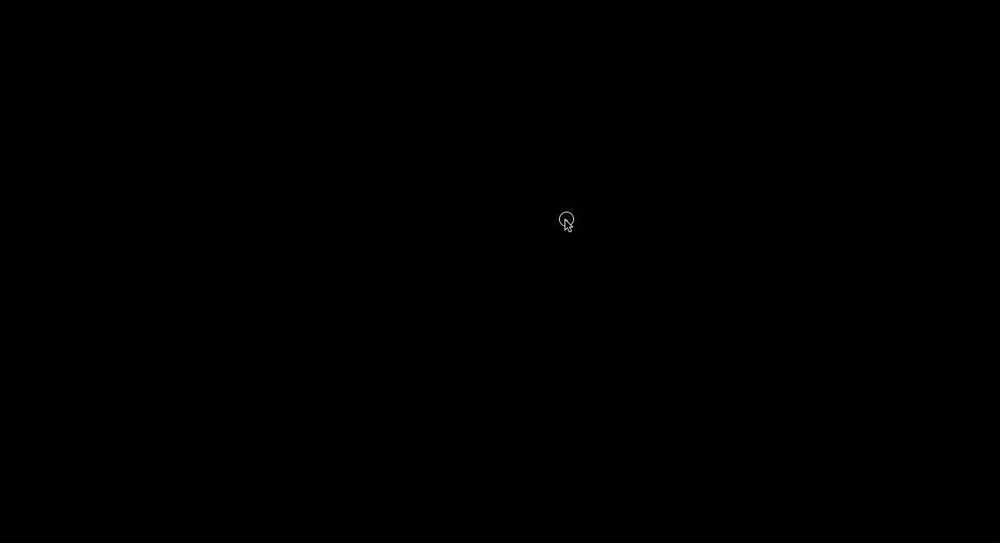

### Brightness when Editing:
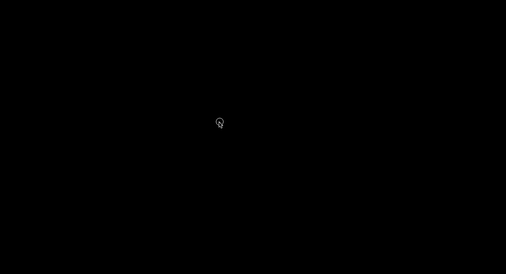

If you need to edit or “uncomplete” a word and then 
“recomplete” it by adding a whitespace back, the brightness is influenced by the original time taken for completion plus the time taken to edit it. 
For example, if it takes me 1 second to type “Prem “, and 5 seconds to edit it, then, the total time for completing the word would be 6 seconds, and the brightness 
would get dimmer than it originally was, as we’ve now taken extra time to complete the word.

## Speed of Cursor Movement on Screen:
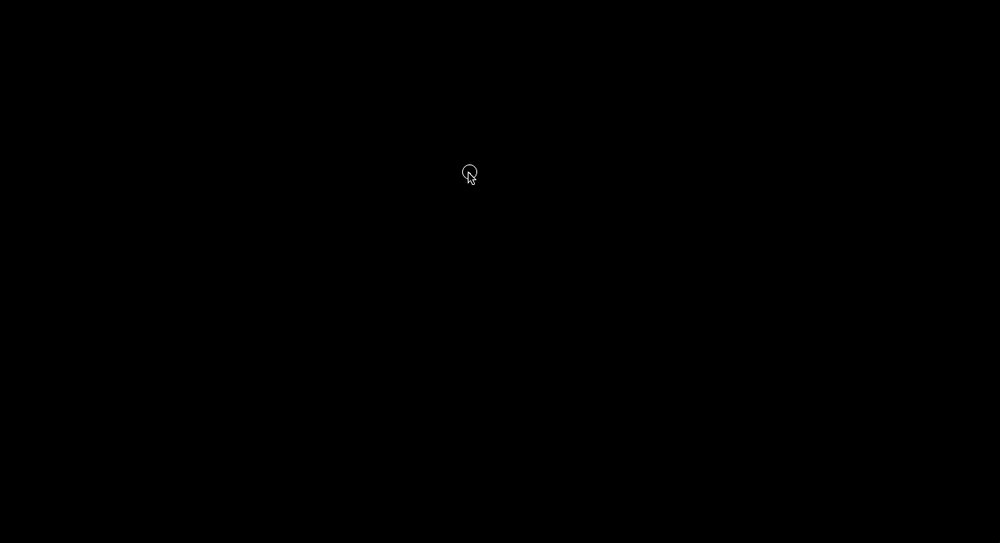

The speed of cursor movement on the screen was mapped to the position and size (length) of a white line following the cursor. 
For example, if you didn’t move the cursor at all, the length of the white line following it would be 0. If you moved it fast, it would be long. 
If you moved it slow, it would be short.

## Mouse Clicks:
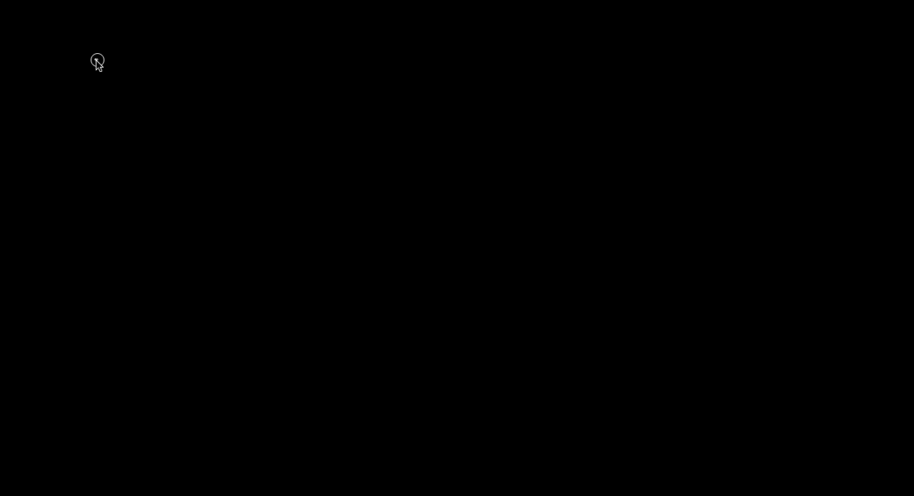

A mouse click was mapped to position (with a shape drawn on the screen corresponding to the position of the click), and the type of mouse click 
(left or right) was mapped to an image (with an asteroid representing a left click and a rocket representing a right click). 
For example, if you left clicked in the top left of the processing panel, an asteroid would be drawn there. 
If you right clicked in the bottom right of the processing panel, a rocket would be drawn there.

&nbsp;

## Features

- Performance: 
&nbsp;

## Limitations/Design Choices

-
&nbsp;

### If you want to start up the project on your local machine:

